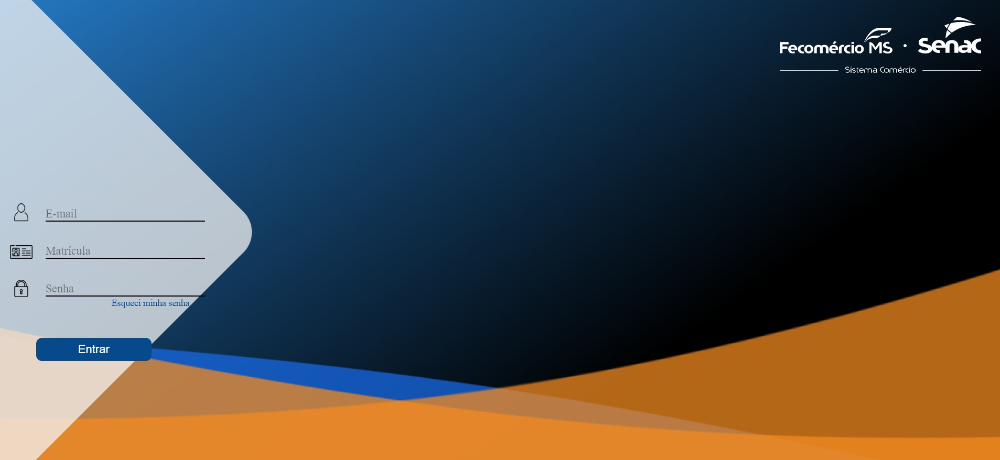
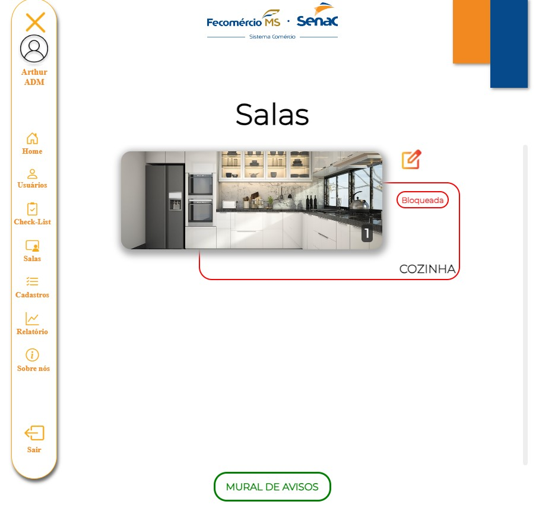
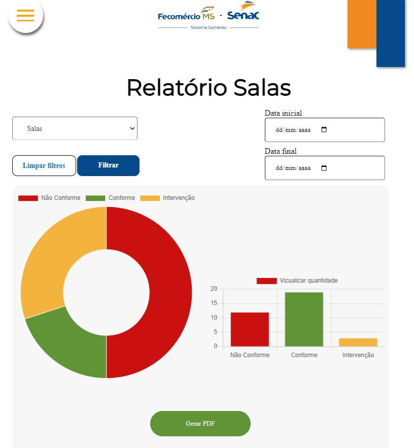
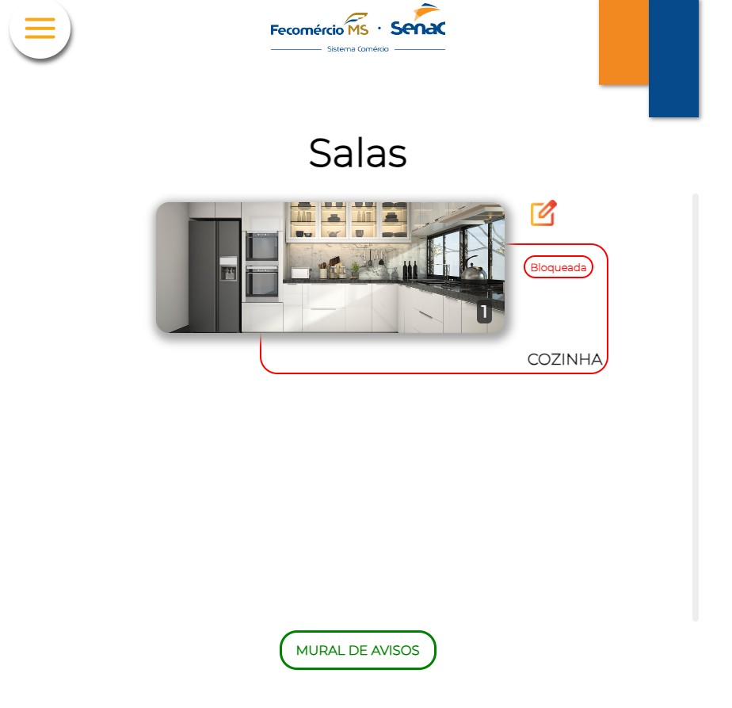
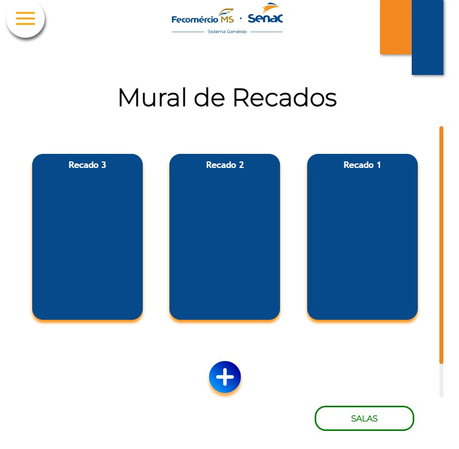
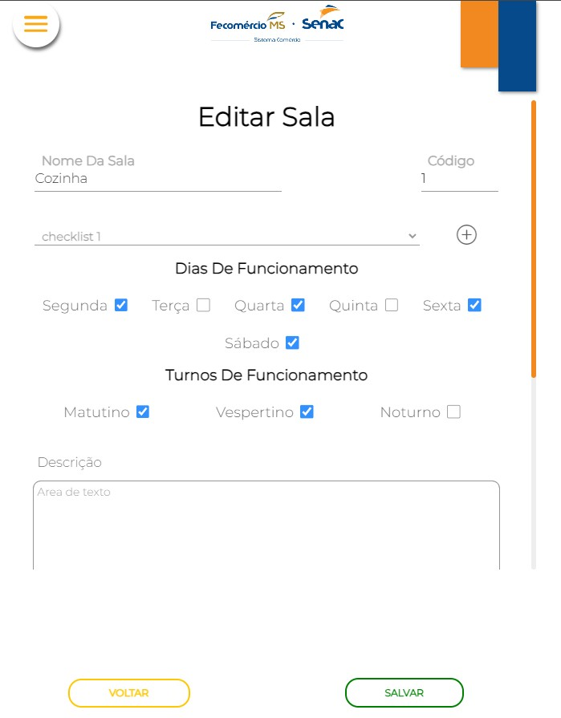

# ETG Escola

O **ETG Escola** é um sistema web desenvolvido como parte de um projeto prático para a unidade do **SENAC Gastronomia**. Ele tem como objetivo auxiliar na organização e controle de atividades internas da escola, com foco em gestão eficiente e interface amigável.

## 📸 Prints do Projeto

| Tela de Login | Menu Principal | Relatório de Salas |
|:-------------:|:--------------:|:------------------:|
|  |  |  |

| Salas Cadastradas | Tela de Recados | Edição de Sala |
|:-----------------:|:---------------:|:--------------:|
|  |  |  |

## 🚀 Tecnologias Utilizadas

Este projeto foi construído utilizando as seguintes tecnologias:

- **HTML5** e **CSS3** — Para a estrutura e estilo das páginas.
- **JavaScript** — Para interações e funcionalidades no front-end.
- **PHP** — Back-end responsável pela lógica da aplicação e comunicação com o banco de dados.
- **MySQL** — Banco de dados relacional usado para armazenar as informações do sistema.
- **SQL** — Consultas e manipulação de dados no banco.
- **Git** e **GitHub** — Controle de versão e hospedagem do código.
- **Metodologias Ágeis** — Organização e acompanhamento do progresso do desenvolvimento.

## 📁 Estrutura do Projeto

O projeto está dividido em diretórios organizados conforme as responsabilidades de cada parte da aplicação:

- `pages/` — Contém as páginas principais do sistema.
- `includes/` — Arquivos reutilizáveis, como cabeçalhos, rodapés e conexões.
- `assets/` — Imagens, folhas de estilo e scripts.
- `db/` — Arquivos relacionados ao banco de dados e configurações.

## 💡 Funcionalidades

- Cadastro e gerenciamento de alunos.
- Controle de turmas e professores.
- Relatórios administrativos.
- Interface simples e acessível.

## 📌 Requisitos

- PHP 7.4+
- MySQL
- Servidor local (XAMPP, WAMP, Laragon ou equivalente)

---

Desenvolvido com 💻 por **Arthur Skl** e equipe.
